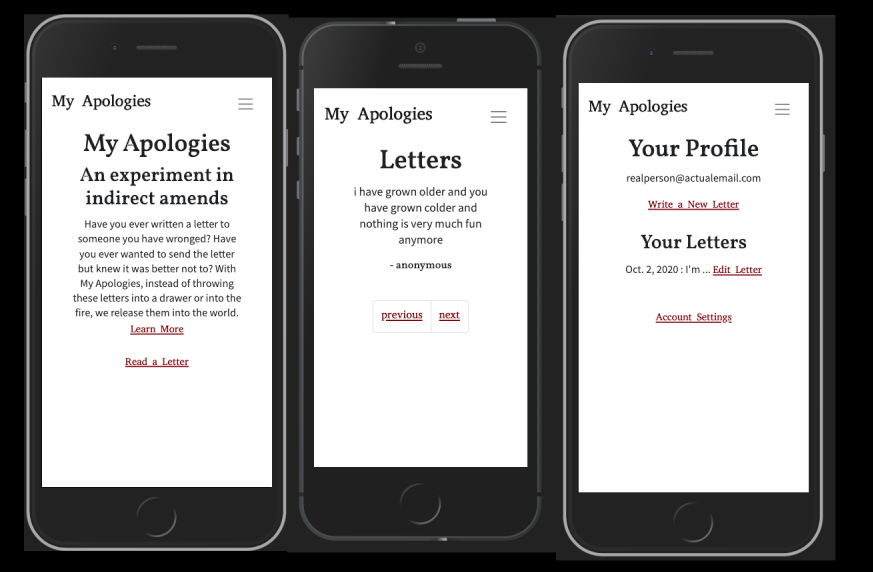
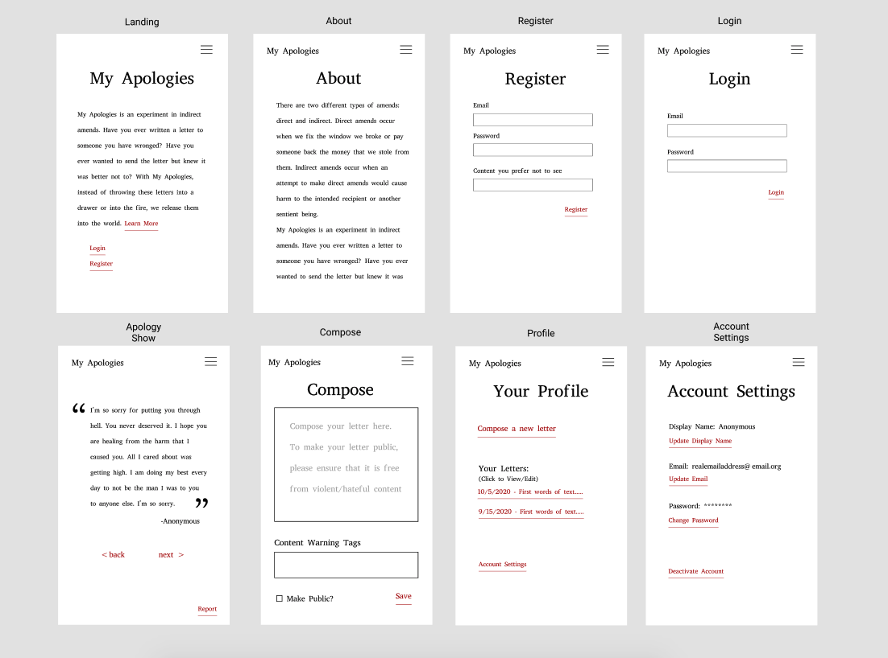

# My Apologies

My Apologies is an experiment in indirect amends. Have you ever written a letter to someone you have wronged, knowing that you wouldn't send it? The purpose of My Apologies is to release these letters into the world anonymously and make them available for people on both sides of the amends process to promote healing and growth. 




## Preparation
### User Stories
- As a user, I would like to write an apology letter and release it into the world.
- As a user I would like to be able to save a draft of my apology so I can work on it in multiple sittings
- As a user, If I have second thoughts, I want to be able to edit or delete my apology letters and account.

### Wireframes
[Link to Wireframes on Figma](https://www.figma.com/file/MkelSkwMCRqy6a2QTRiwLt/MyApologiesWireframe?node-id=0%3A1)
 

### Pitch Deck
See the complete pitch deck on  [Google Drive](https://docs.google.com/document/d/1D2cQqUxWcSmBdwiyAAjSbBIYetQLUkp_EGxUmXwkeW0/edit?usp=sharing)

## Technologies
For this project, I utilized Python with Django, PostgreSQL, the django-taggit module, and Bootstrap. 

## Installation Instructions
To install the app locally, make sure you have [Python 3.8](https://www.python.org/downloads/release/python-380/) installed (for Homebrew users, you can run `brew install python@3.8`.) Once Python is installed, you'll need to use pip install the `pipenv` module with `pip3 install pipenv`. Fork and clone this repo, `cd` into the local directory and run `pipenv install` to download the dependencies.

## Approach
I started this particular app by creating a local database and a custom user class named `Account` that inherits from Django's `AbstractBaseUser` class. 

```py
# main_app/models.py
class Account(AbstractBaseUser):
  email = models.EmailField(verbose_name="email", max_length=60, unique=True)
  display_name = models.CharField(max_length=30, default='Anonymous')
  user_tags = models.CharField(max_length=1500, blank=True, null=True)

  # The following fields are required by AbstractBaseUser to create custom User model.
  username = models.CharField(max_length=30, unique=True)
  date_joined = models.DateTimeField(verbose_name='date joined', auto_now_add=True)
  last_login = models.DateTimeField(verbose_name='last login', auto_now=True)
  is_admin = models.BooleanField(default=False)
  is_active = models.BooleanField(default=True)
  is_staff = models.BooleanField(default=False)
  is_superuser = models.BooleanField(default=False)

  # instead of username, login with email
  USERNAME_FIELD = 'email'
  ...
```
From there I built `MyAccountManager`, an admin panel view to correspond with the Account model as well as the custom `AccountAuthenticationForm` and `RegistrationForm` classes to authenticate the Account model. Like the custom account class, these two classes also inherit from built in Django classes (`UserCreationForm` and `ModelForm`, respectively). To test these new classes, I built a protected profile view, set a url pattern, and created the corresponding template. I hit an interesting snag here. In my `Account` model, the user's email is used for authorization and I opted to use a non-unique field called `display_name` instead of `username`. Upon testing this, I realized that username was indeed a required field when inheriting from the `AbstractBaseUser`. As a workaround, in `models.py` I defined a method to automatically set the user's username to their email:
```py
# main_app/models.py
def set_username(sender, instance, **kwargs): # **kwargs pass keyworded variables to this function
  if not instance.username:
    instance.username = instance.email
```
Then in the registration_view funtion I used a pre save signal to call the function:
```py
def registration_view(request):
  ...
    form = RegistrationForm(request.POST)
    if form.is_valid():
      pre_save.connect(set_username, sender=Account)
      form.save()
```
After testing account authorization successfully, I created the account settings view and built implemented forms to change both the user's display name and password. Once I had achieved full CRUD capabilities on Account, I moved on to CRUDing Apology letters. Once the Apology letters were successfully populating on the backend, I used Django's Pagination feature to paginate the most recent apology letters in `templates/apologies/index.html`.

## Unsolved Problems/Hurdles
The largest unsolved problem at the time of writing this would be successfully rendering static files in production. Bootstrap styles are being successfully applied to page elements on the Heroku App, but not the custom styles described in `main_app/static/style.css`. The error in the dev tools console indicates a MIME type issue.
```
Refused to apply style from 'https://my-apologies.herokuapp.com/static/style.css' because its MIME type ('text/html') is not a supported stylesheet MIME type, and strict MIME checking is enabled.
```
I attempted to fix this by importing Python's `mimetypes` module in `settings.py` and calling its `add_type()` method. I refactored the static configuration in settings.py multiple times, ultimately with no luck. The deployed app is currently functional sans my styling. In the week to come, I look forward to resolving this issue and refining the client side of this project into something truly beautiful.
Getting dumped into the deep end of a Django project with little prior experience with the framework was an excellent learning opportunity. I was able to strenghten my comprehension of the authorization process and get a little more comfortable deploying apps via Heroku. Additionally, I made some valuable mistakes in my version control process: not merging feature branches back into master soon enough, waiting too long to commit, not beginning this readme until the end of the process, etc. I failed early and often with this project and grew as a result.

## What's Next?
The next, crucial step for the app is content moderation. In order to be a truly viable concept, there must be measures in place to defend against harassment, doxxing, and general-purpose trolling. This includes implementing an optional profanity filter and a way to report individual posts. If you'd like to get involved with the project, please feel free to fork and clone this repo or get in touch via [LinkedIn](https://www.linkedin.com/in/blangwell/)! 