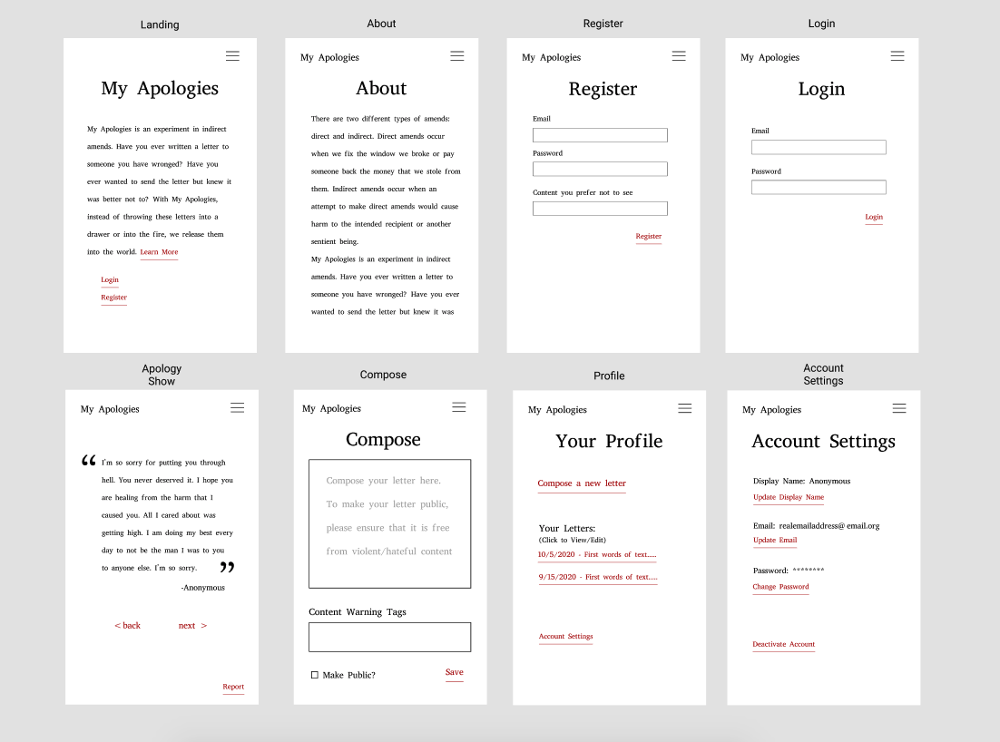

# my-apologies-ga-p4
An experiment in indirect amends

screenshot

## Technologies
For this project, I utilized Python with Django, PostgreSQL, and the django-taggit module. 

## Installation Instructions

## Approach

## User Stories
- As a user, I would like to write an apology letter and release it into the world.
- As a user I would like to be able to save a draft of my apology so I can work on it in multiple sittings
- As a user, If I have second thoughts, I want to be able to edit or delete my apology letters and account.

## Wireframes
[Link to Wireframes on Figma](https://www.figma.com/file/MkelSkwMCRqy6a2QTRiwLt/MyApologiesWireframe?node-id=0%3A1)

## Pitch Deck

## Unsolved Problems/Hurdles